## 👋 Hello! I'm Ching (Jason) Chang 

I am currently a Staff ML Research Scientist at [Pravāh](https://pravah.com/). I am also a PhD candidate (ABD) in Computer Science at National Yang Ming Chiao Tung University (NYCU), Taiwan, advised by [Prof. Wen-Chih Peng](https://sites.google.com/site/wcpeng/). Previously, I was a Visiting Graduate Researcher in Computer Science at UCLA, working with [Prof. Wei Wang](http://web.cs.ucla.edu/~weiwang/).  

My research focuses on **Time-Series Analysis**, **Large Foundation Models**, **Causal Discovery**, and **Multimodal Reasoning**.  
I have published multiple papers in top AI and data science conferences and journals. I have also served as a reviewer for top-tier conferences and journals in the field.

## 🤝 Let's Connect

If you’re interested in collaboration, feel free to contact me:

- 📬 **Email**: [blacksnail789521@gmail.com](mailto:blacksnail789521@gmail.com)  
- 🌐 **Website**: [blacksnail789521.github.io](https://blacksnail789521.github.io/)
- 💼 **LinkedIn**: [Ching Chang](https://www.linkedin.com/in/ching-chang/)
- 📄 **Resume**: [View PDF](https://drive.google.com/file/d/1eRdYM8OSQdDivrsxibaa-aeC_EphcOlx/view?usp=sharing)
- 🎓 **Google Scholar**: [Profile](https://scholar.google.com.tw/citations?user=OXCVj48AAAAJ)

## 📊 GitHub Stats

